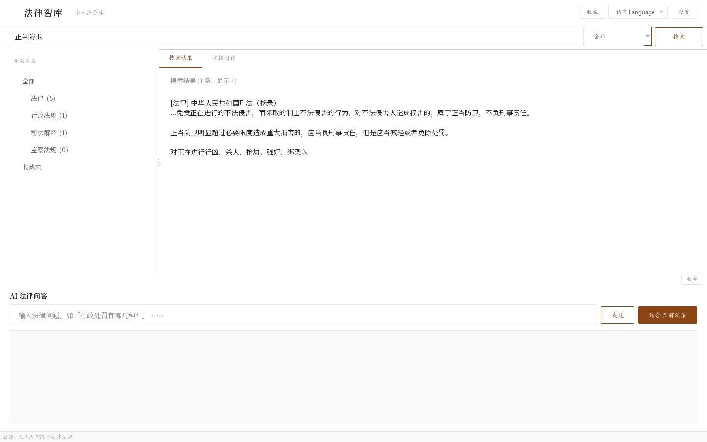
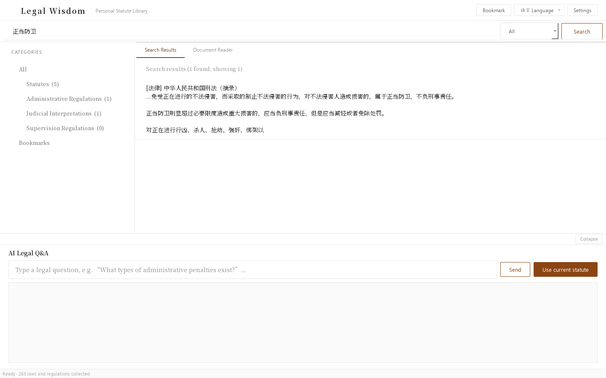

English · [简体中文](./README.zh-CN.md)

# ⚖️ Legal Wisdom (法律智库) · Personal Statute Library

> **TL;DR** — A local desktop statute library: 257 Chinese laws & regulations with SQLite FTS5 full-text search, cross-reference suggestions between articles, and LLM Q&A grounded in the statute you're reading. The corpus is excluded from the repo for licensing/size — **fully reproducible**: rebuild the whole 87MB database from public sources with one documented pipeline ([docs/repro.md](docs/repro.md)). Hybrid retrieval with citation grounding evolves in [statute-rag](https://github.com/1438388098-glitch/statute-rag).

A local desktop application covering **257 Chinese laws and regulations**, supporting full-text search, AI Q&A, and cross-referenced statute browsing.

> ℹ️ **Reproducible data**: core codes such as the Constitution, the Civil Code and the Criminal Law are not yet in the database (source corpus missing). Keeping the database out of the repo is a deliberate trade-off around size and redistribution boundaries — all 87MB of data can be rebuilt from official public sources with the one-command pipeline documented in [docs/repro.md](docs/repro.md).

## Features

| Feature | Description |
|---------|-------------|
| 🔍 **Full-text search** | Search engine based on SQLite FTS5, with keyword highlighting |
| 📂 **Category browsing** | Browse by statute / administrative regulation / judicial interpretation / supervision regulation |
| 📄 **Document reader** | Built-in reader with automatic highlighting of chapter headings and article numbers |
| 🔗 **Statute cross-references** | Related statutes suggested automatically while reading, one-click navigation |
| 💬 **AI Q&A** | Connects to LLM APIs; ask questions grounded in the statute you are reading |
| ⭐ **Bookmarks** | Bookmark frequently used statutes for quick lookup |
| 🌐 **Bilingual UI** | Switch the interface between 中文 and English from the title-bar language menu; the choice is remembered |

> **Retrieval caveat**: full-text search is a hybrid of SQLite FTS5 + LIKE — under the unicode61 tokenizer a run of consecutive Chinese characters counts as a single token, so Chinese substring queries are mainly served by the LIKE fuzzy fallback (English/number tokens can hit FTS and get highlighted). This is **not** semantic/vector retrieval; hybrid retrieval RAG with citation grounding is on the roadmap. The database is not committed due to size and redistribution boundaries; rebuild it from scratch per [docs/repro.md](docs/repro.md).

## Screenshots

| 中文界面 | English UI |
|----------|------------|
|  |  |

> Both screenshots are real offscreen renders of the desktop app (PySide6), showing a search for "正当防卫" (justifiable defense). They use a lightweight **demo database of 7 public-law excerpts**, not the full 87MB corpus. The bilingual switch covers UI chrome only — statute content itself is not translated.

## Data sources

- **Statutes** (70) — single laws such as the Foreign Investment Law, the Fire Protection Law and the Construction Law
- **Administrative regulations** (132) — implementation rules and administrative measures across domains
- **Judicial interpretations** (53) — interpretations by the Supreme People's Court and the Supreme People's Procuratorate
- **Supervision regulations** (2) — regulations related to supervision law
- The numbers above are the actual counts currently in the database (257 in total); data is updated to **2026**

## Usage

### Run from source

```bash
pip install -r requirements.txt
python main.py
```

### Build the exe (optional)

The repository does not distribute binaries. To get an exe, build it yourself with PyInstaller:

```bash
python build.py   # or: pyinstaller 法律智库.spec
```

On first launch, a data directory is created under `%USERPROFILE%\.法律智库\` (can be redirected with the `LEGAL_WISDOM_DATA` environment variable).

### AI configuration

1. Click **设置 (Settings)** in the top-right corner
2. Choose an AI provider (DeepSeek / OpenAI / SiliconFlow / Zhipu)
3. Enter your API Key
4. Type your legal question in the AI panel at the bottom

**Recommended:** [DeepSeek](https://platform.deepseek.com/) (fast access in mainland China, good value for money)

### Search tips

- Type keywords such as **"行政处罚"** (administrative penalty), "正当防卫" (justifiable defense) or "合同效力" (contract validity)
- Click a search result to open its full text
- While reading, click **"结合当前法条"** (use current statute) to have the AI answer based on the statute you are viewing

## Development

### Requirements

- Python 3.13+
- PySide6
- pdfminer.six
- python-docx

### Install dependencies

```bash
pip install PySide6 pdfminer.six python-docx pyinstaller
```

### Import data

```bash
python3 data/database/import_data.py
```

### Packaging

```bash
python3 build.py
```

## Project structure

```
legal-wisdom-app/
├── main.py                    # Desktop entry point (PySide6)
├── webapp.py                  # Flask web backend (optional)
├── app/
│   └── main_window.py        # Main window
├── assets/
│   └── styles.qss            # Stylesheet
├── data/
│   ├── parsers/              # PDF/DOCX parsers
│   └── database/             # Database & search
├── services/
│   ├── ai_service.py         # AI API calls
│   └── law_refs.py           # Statute cross-references
├── static/                   # Web frontend static assets
├── tests/                    # Unit tests (search main paths + statute references)
├── build.py                  # Packaging script
├── run.bat                   # One-click launcher
└── requirements.txt
```
